# IdeaFlow 💡

IdeaFlow is a premium Android application designed to help creators, developers, and entrepreneurs track their ideas from initial spark to final execution. It provides a structured "Flow" environment to manage progress, categorize thoughts, and maintain a historical archive of completed projects.

## 🚀 Key Features

- **Dynamic Dashboard**: Real-time summary of total ideas and active flows with quick access to recent projects.
- **Structured Idea Library**: Advanced filtering by category (Tech, Business, Personal) and real-time search functionality.
- **Creative Flow Tracking**: Visualize progress through 4 key stages: Concept, Research, Planning, and Execution.
- **Premium UI/UX**: Modern design featuring edge-to-edge layouts, custom gradients, and a branded splash screen.
- **Persistent Storage**: All ideas are securely stored locally on the device using Gson serialization.
- **Dual Navigation**: Seamless transition between Side Navigation Drawer and Bottom Navigation.

---

## 📱 UI Showcase

<p align="center">
  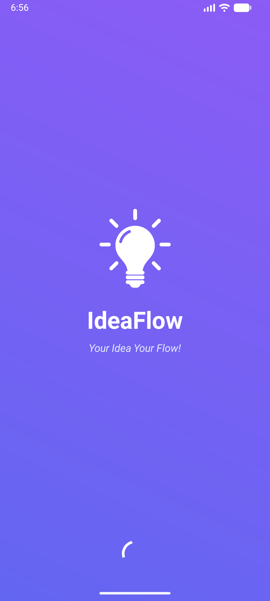
  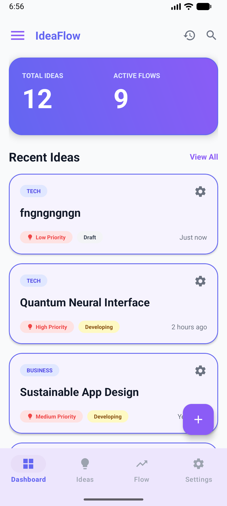
  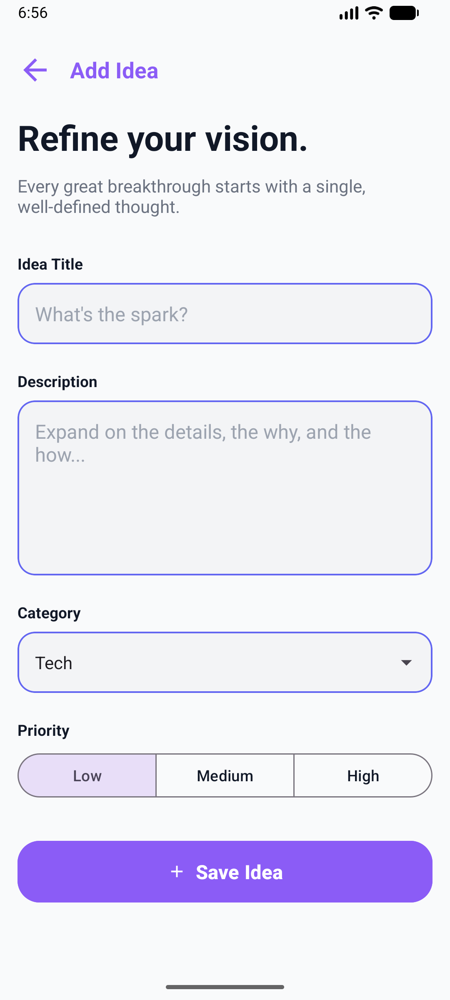
</p>

<p align="center">
  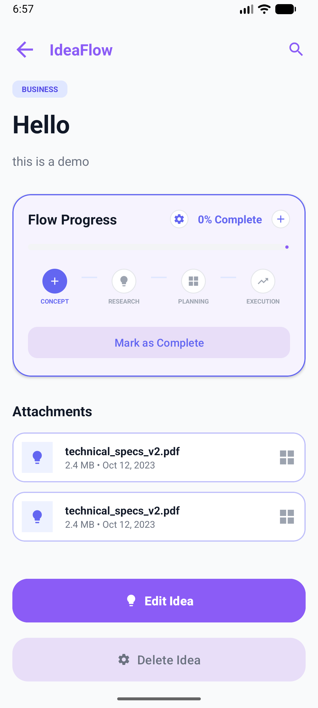
  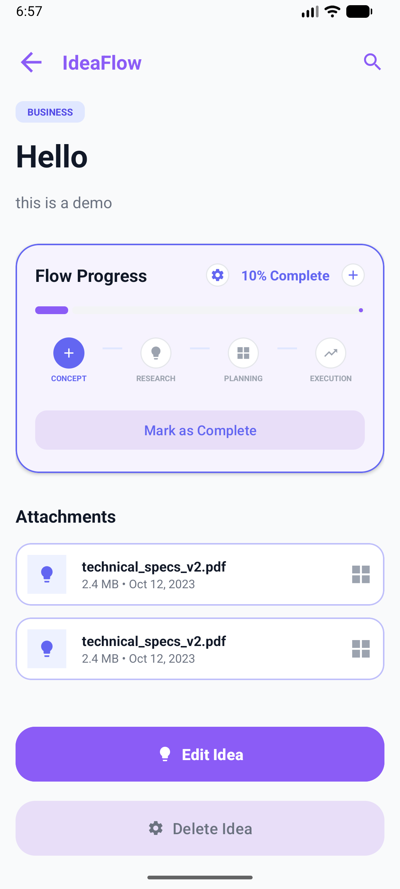
  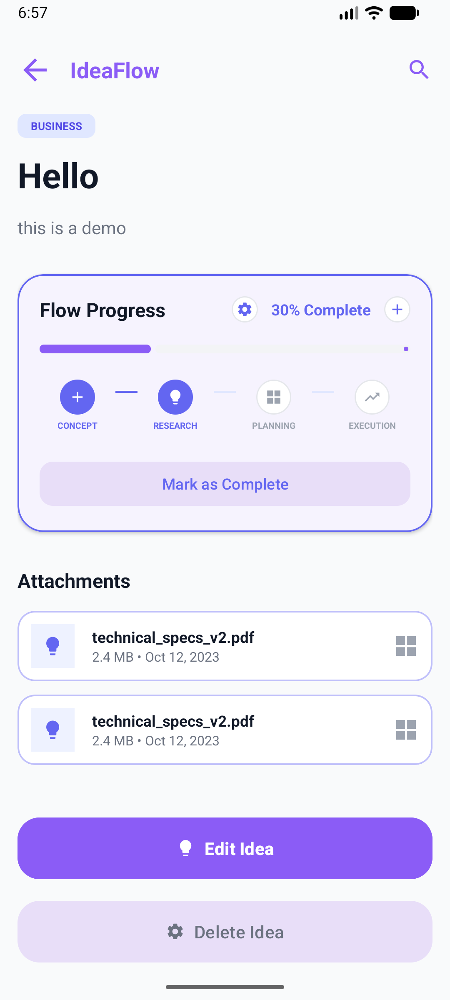
</p>

<p align="center">
  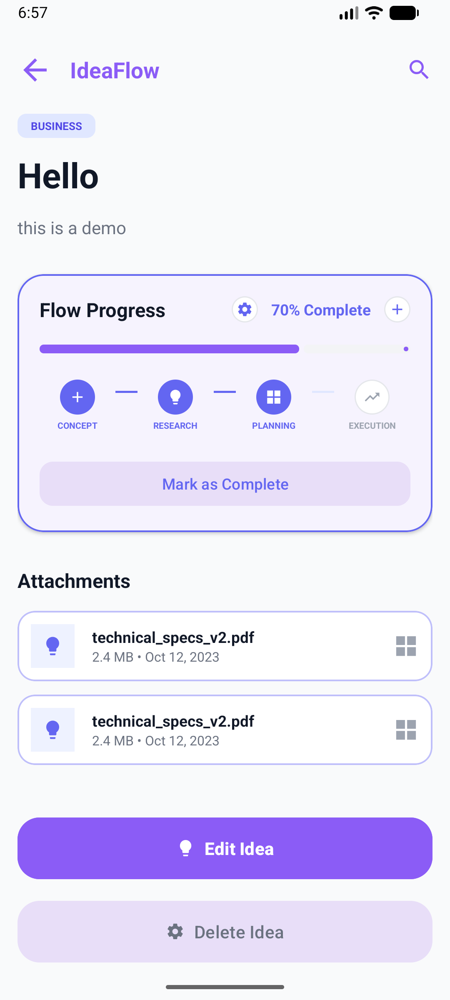
  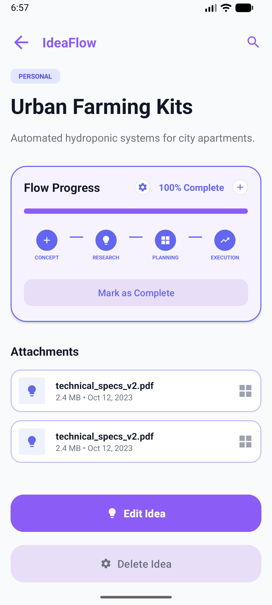
  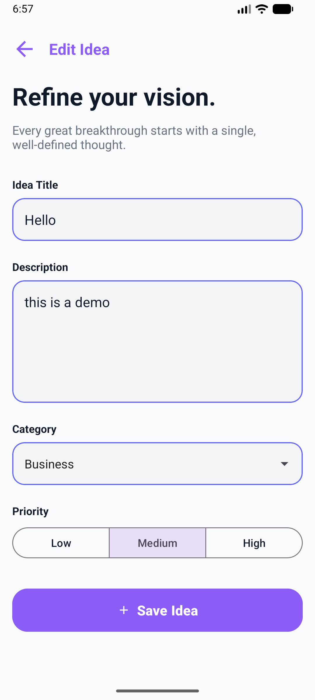
</p>

<p align="center">
  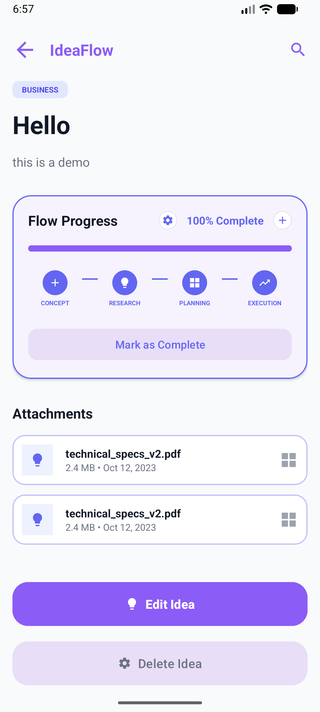
  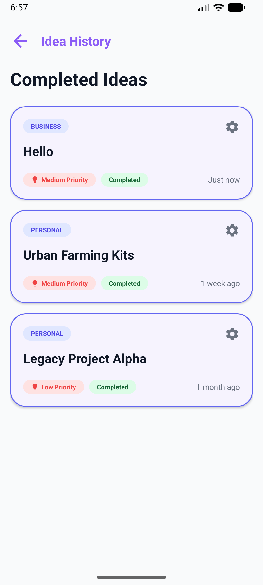
  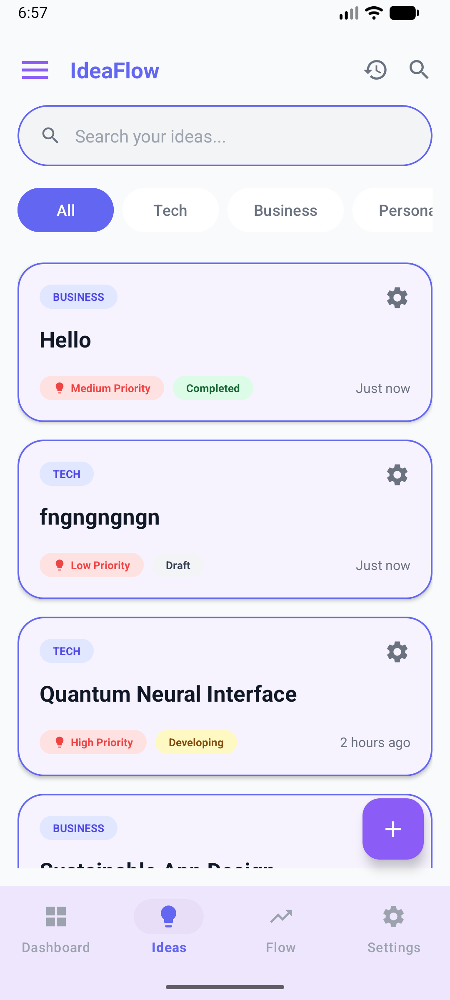
</p>

<p align="center">
  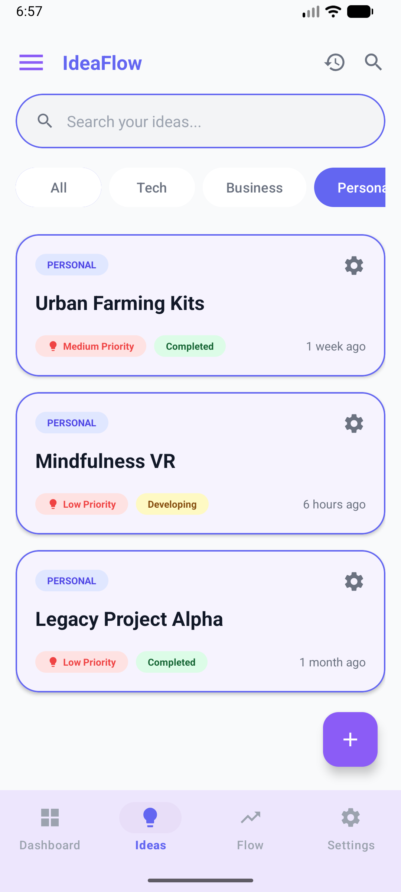
  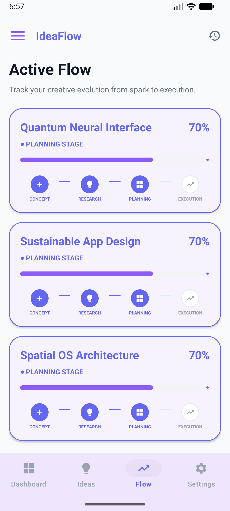
  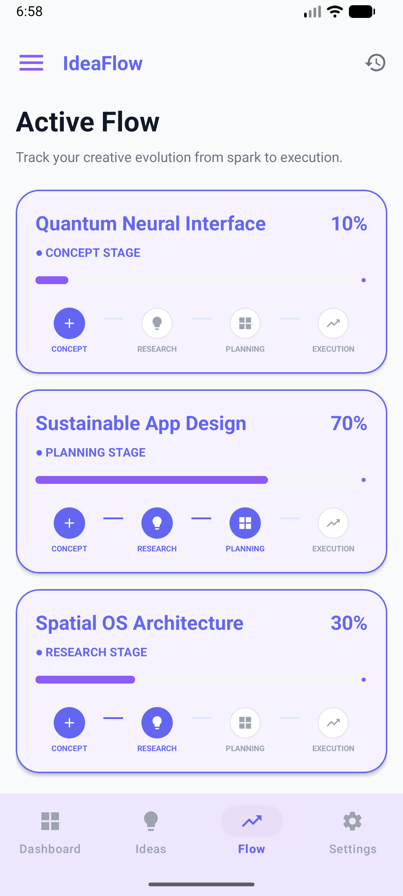
</p>

<p align="center">
  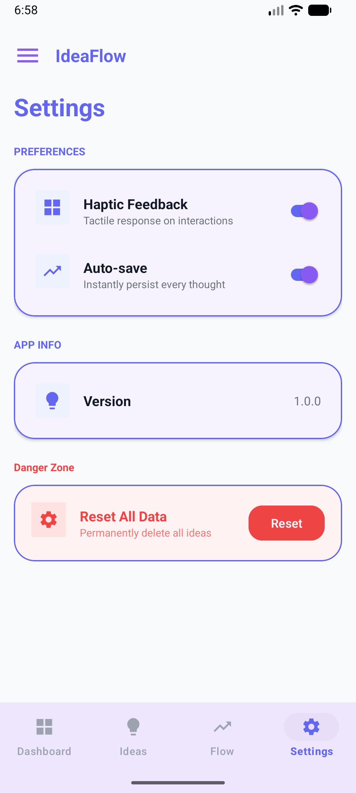
  
  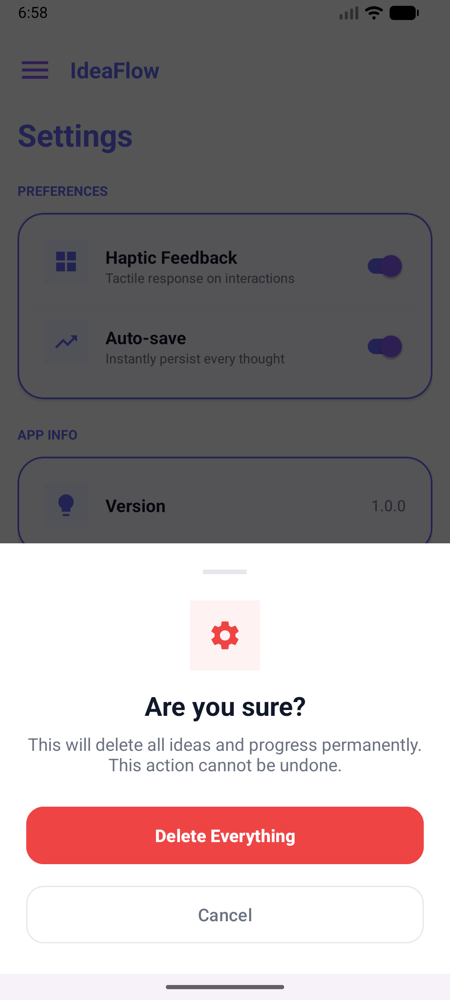
</p>

---

## 🛠️ Built With

- **Kotlin**: Primary programming language.
- **Material Components**: Premium UI design system.
- **ViewPager2 & Fragments**: Modular navigation system.
- **ViewModel & LiveData**: Reactive data handling.
- **Gson**: Data persistence for offline support.
- **ConstraintLayout**: Responsive UI design.

## 🏁 Getting Started

1. **Clone the repository**:
   ```bash
   git clone https://github.com/yourusername/IdeaFlow.git
   ```
2. **Open in Android Studio**:
   Import the project and let Gradle sync.
3. **Run the App**:
   Select your device and click **Run**.

---

## Developed with ❤️ by Rohan Rusho
